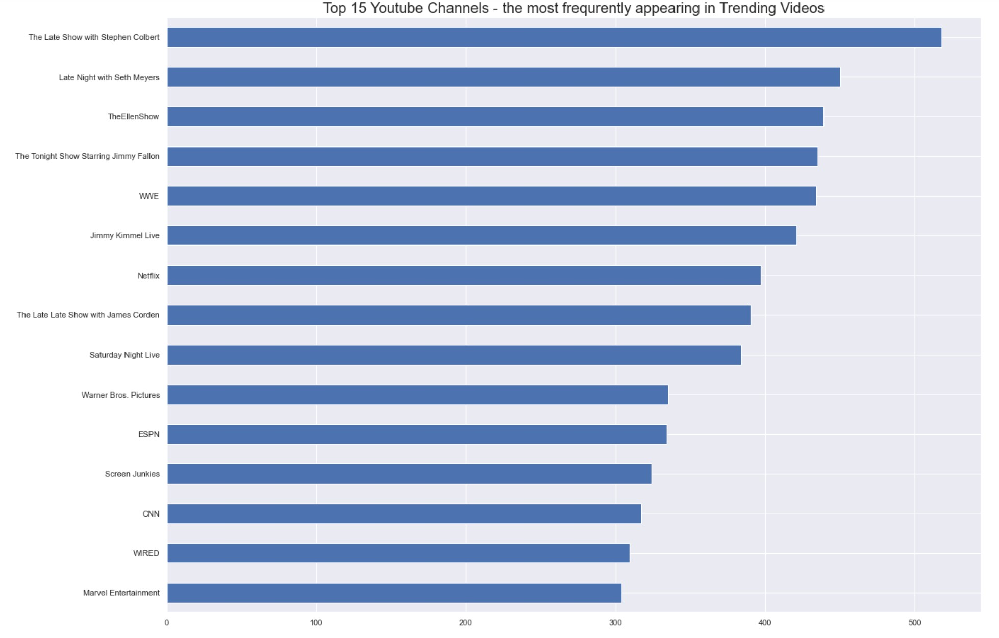

# pandas-eda-case-study-youtupe

Trending YouTube Video 

YouTube is a video-sharing service where users can watch, like, share, comment, and upload their own videos. The video service can be accessed on PCs, laptops, tablets, and mobile phones.

-Our Goal:
To Answer the following questions:

the most trending (top 15) Youtube Channels in US,GB,jp and FR?

correlation between likes ,dislikes ,views and comment.

Top 1 Popular videos from each category?

Top 1 Popular videos from each country?

Top 1 like videos from each country?

Trending video have Disabled Comment?

identify the top 5 videos in USA?

-DATA cleansing:
The raw data about trending videos in youtube was given to start with to answer our questions

we analyzed the data and removed duplicat values

-bulding our Jupyter notebook:
we built Jupyter notebook using pandas and  numpy, matplotlib and seaborn

-Results:answered our questions, visulization:
