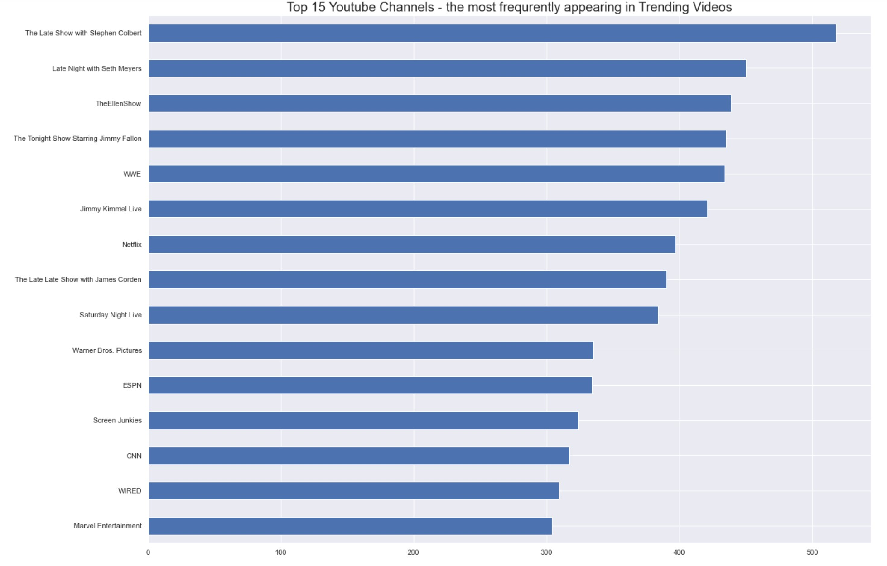
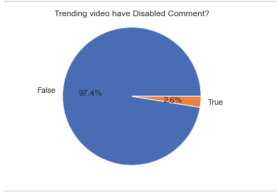
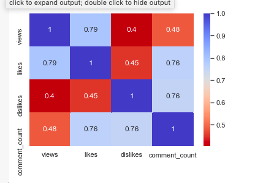
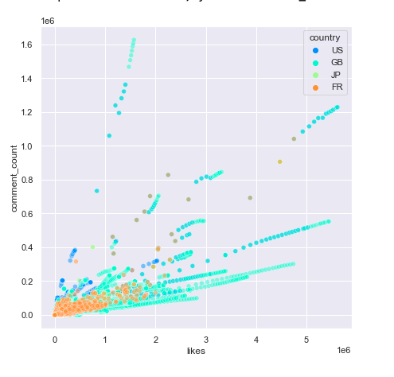
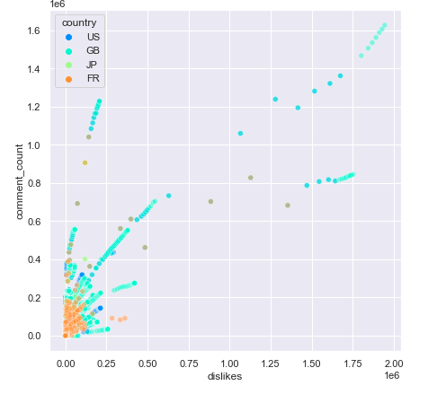
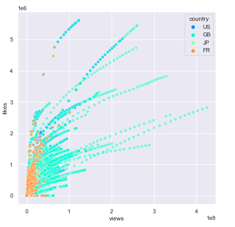
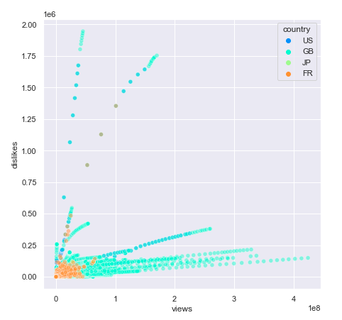
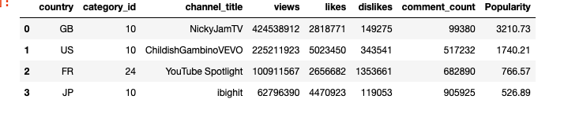
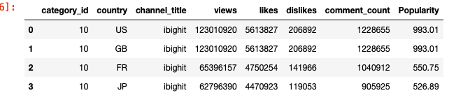
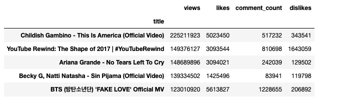

# pandas-eda-case-study-youtupe

## _Trending YouTube Video_

YouTube is a video-sharing service where users can watch, like, share, comment, and upload their own videos. The video service can be accessed on PCs, laptops, tablets, and mobile phones.

## Our Goal:
To Answer the following questions:

- The most trending (top 15) Youtube Channels in US,GB,jp and FR?

- Trending video have Disabled Comment?

- correlation between likes ,dislikes ,views and comment.

- Top 1 Popular videos from each category?

- Top 1 Popular videos from each country?

- Top 1 like videos from each country?

- identify the top 5 videos in USA?

## DATA cleansing:

The raw data about trending videos in youtube was given to start with to answer our questions

We analyzed the data and removed duplicat values

```sh
USvideo.drop_duplicates(subset=['video_id']) 
GBvideo.drop_duplicates(subset=['video_id'])
JPvideo.drop_duplicates(subset=['video_id'])
FRvideo.drop_duplicates(subset=['video_id']) 
```
## Building our Jupyter notebook:
we built Jupyter notebook using pandas and  numpy, matplotlib and seaborn

## Results: answered our questions, visulization:

the most trending (top 15) Youtube Channels in US,GB,jp and FR?



After analyzing the data we noticed that in the  histogram, that the late show and late night and the Ellen show have the most trending videos , also, these channels have in common that all of them are talk shows.


Trending video have Disabled Comment?



Analyzing data from comment disable columns in all countries we discovered that trending videos mostly associated with comments and 2.6% have disabled comments.


correlation between likes ,dislikes ,views and comment.



This is correlation values: 1= a strong positive correlation O = no correlation -1 = strong negative correlation. This shows that there is a strong positive correlation with number of likes and number of views, while there is a moderate correlation between views and comment count


like and comment in scatter plot



dislike and comment in scatter plot



views and like in scatter plot



views and dislike in scatter plot



Popular videos from each country



Top 1 like videos from each country



identify the top 5 videos in USA?




## Future works:

- Funcation for print top 5 in each country

- Dose the thumbnail each on like or views

- What the most word used in tags


